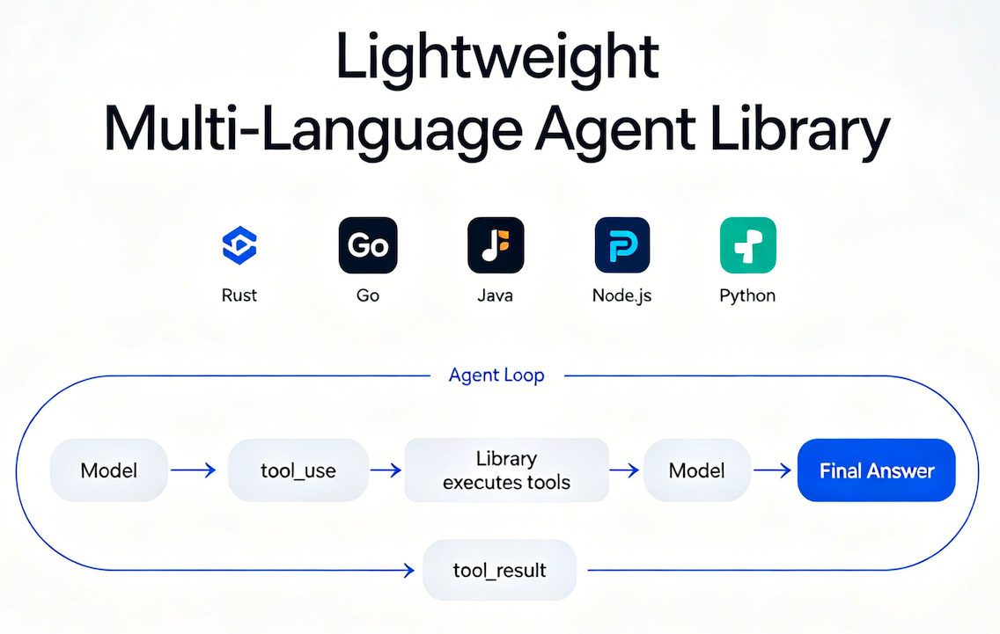

# agent-libs

<div align="center">
  
</div>

一个轻量级的多语言 Agent 库（Rust / Go / Java / Node.js / Python），核心能力是对接 Anthropic Messages API（以及兼容 API），实现标准的 agent-loop：模型可自主发起工具调用（tool_use），库负责执行工具并把结果（tool_result）回填给模型，直到产出最终回答。

## 支持语言

| 语言 | 代码目录 | 包名/模块名 |
| --- | --- | --- |
| Go | `go/` | `github.com/steven0lisa/agent-libs/go` |
| Java | `java/` | `com.agentlib:agentlib` |
| Node.js | `nodejs/` | `@zhangzichao2008/agent-lib` |
| Python | `python/` | `agentlib` |
| Rust | `rust/` | `agentlib` |

## 环境变量（通用）

- 必填：`ANTHROPIC_AUTH_TOKEN` 或 `ANTHROPIC_API_KEY`
- 可选：`ANTHROPIC_BASE_URL`（默认 `https://api.anthropic.com`）
- 可选：`ANTHROPIC_MODEL`（默认 `claude-sonnet-4-6`，以各语言默认实现为准）
- 可选：`AGENT_WORK_DIR`（工作目录；涉及文件/命令工具时会以此为沙箱基准，以各语言实现为准）

## 内置工具（通用）

- `read_file`：读取文件
- `write_file`：写入/创建文件
- `update_file`：替换文件内容
- `bash`：执行 shell 命令
- `curl`：HTTP 请求
- `subagent`：子 Agent 调用

## Auto Compact

当对话历史增长接近模型上下文窗口限制时，Agent 会自动压缩历史消息以保持性能。

- 默认启用，可通过配置关闭
- 触发阈值默认为上下文窗口的 80%（200K * 0.8 = 160K tokens）
- 压缩时通过 API 生成摘要替换旧消息，保留最近的消息

```python
config = AgentConfig(
    api_key="...",
    auto_compact=True,               # 是否启用自动压缩（默认 True）
    context_window_size=200_000,     # 模型上下文窗口大小
    auto_compact_threshold_pct=0.8,  # 触发阈值百分比
)
```

## 目录访问控制

可以配置 Agent 允许读写的目录列表：

```python
config = AgentConfig(
    api_key="...",
    work_dir="/project",
    allowed_read_dirs=["/data", "/logs"],    # 允许读取的额外目录
    allowed_write_dirs=["/output"],           # 允许写入的额外目录
)
```

- `work_dir` 始终可读写
- 空列表表示仅 `work_dir` 可访问（默认行为，向后兼容）
- Skill 目录默认可读

## 基本使用说明（各语言）

下面示例均为“打印流式输出 + 最终结果”的最小用法，你只需要准备好 API Key 环境变量即可运行/集成。

### Go

安装（从远端依赖）：

```bash
go get github.com/steven0lisa/agent-libs/go@latest
```

代码示例：

```go
package main

import (
	"context"
	"fmt"
	"os"

	agentlib "github.com/steven0lisa/agent-libs/go"
)

func main() {
	cfg := agentlib.DefaultConfig()
	cfg.APIKey = os.Getenv("ANTHROPIC_AUTH_TOKEN")
	if cfg.APIKey == "" {
		cfg.APIKey = os.Getenv("ANTHROPIC_API_KEY")
	}
	if baseURL := os.Getenv("ANTHROPIC_BASE_URL"); baseURL != "" {
		cfg.BaseURL = baseURL
	}
	if model := os.Getenv("ANTHROPIC_MODEL"); model != "" {
		cfg.Model = model
	}

	agent := agentlib.NewAgent(cfg)
	ctx := context.Background()

	for event := range agent.Run(ctx, "Please list the files in the current directory") {
		switch event.Type {
		case agentlib.EventMessageDelta:
			fmt.Print(event.Data["text"])
		case agentlib.EventComplete:
			fmt.Printf("\n\n[Complete] %s\n", event.Data["final_content"])
		case agentlib.EventError:
			fmt.Printf("\n[Error] %s\n", event.Data["message"])
		}
	}
}
```

本仓库快速验证：

```bash
cd go
go test ./...
```

### Java

本仓库构建/测试（会产出本地 Maven 工件）：

```bash
cd java
mvn test
```

在你的项目中依赖（本地安装后可用）：

```xml
<dependency>
  <groupId>com.agentlib</groupId>
  <artifactId>agentlib</artifactId>
  <version>1.0.0-SNAPSHOT</version>
</dependency>
```

代码示例：

```java
import com.agentlib.*;
import java.util.concurrent.Flow;

public class BasicUsage {
  public static void main(String[] args) {
    AgentConfig config = AgentConfig.builder()
      .apiKey(System.getenv("ANTHROPIC_AUTH_TOKEN"))
      .baseUrl(System.getenv().getOrDefault("ANTHROPIC_BASE_URL", "https://api.anthropic.com"))
      .model(System.getenv().getOrDefault("ANTHROPIC_MODEL", "claude-sonnet-4-6"))
      .build();

    Agent agent = new Agent(config);
    agent.run("Please list the files in the current directory")
      .subscribe(new Flow.Subscriber<Event>() {
        private Flow.Subscription subscription;

        @Override public void onSubscribe(Flow.Subscription s) {
          this.subscription = s;
          s.request(Long.MAX_VALUE);
        }

        @Override public void onNext(Event event) {
          switch (event) {
            case MessageDeltaEvent e -> System.out.print(e.getText());
            case CompleteEvent e -> System.out.println("\n\n[Complete] " + e.getFinalContent());
            case ErrorEvent e -> System.err.println("\n[Error] " + e.getMessage());
            default -> {}
          }
        }

        @Override public void onError(Throwable t) { t.printStackTrace(); }
        @Override public void onComplete() {}
      });
  }
}
```

### Node.js（TypeScript/ESM）

安装：

```bash
npm i @zhangzichao2008/agent-lib
```

代码示例：

```ts
import { Agent, resolveConfig } from '@zhangzichao2008/agent-lib';

async function main() {
  const config = resolveConfig({
    apiKey: process.env.ANTHROPIC_AUTH_TOKEN || process.env.ANTHROPIC_API_KEY || '',
    baseUrl: process.env.ANTHROPIC_BASE_URL,
    model: process.env.ANTHROPIC_MODEL,
  });

  const agent = new Agent(config);

  for await (const event of agent.run('Please list the files in the current directory')) {
    if (event.type === 'message_delta') {
      process.stdout.write(event.data.text as string);
    } else if (event.type === 'complete') {
      console.log('\n\n[Complete]', event.data.final_content);
    } else if (event.type === 'error') {
      console.error('\n[Error]', event.data.message);
    }
  }
}

main().catch(console.error);
```

本仓库快速验证：

```bash
cd nodejs
npm ci
npm run build
npm test
```

### Python

从本仓库安装（推荐开发态）：

```bash
pip install -e ./python
```

代码示例：

```python
import asyncio
import os

from agentlib import Agent, AgentConfig


async def main():
    config = AgentConfig(
        api_key=os.environ.get("ANTHROPIC_AUTH_TOKEN") or os.environ.get("ANTHROPIC_API_KEY", ""),
        base_url=os.environ.get("ANTHROPIC_BASE_URL", "https://api.anthropic.com"),
        model=os.environ.get("ANTHROPIC_MODEL", "claude-sonnet-4-6"),
        work_dir=os.getcwd(),
    )

    agent = Agent(config)

    async for event in agent.run("Please list the files in the current directory"):
        if event.type.value == "message_delta":
            print(event.data["text"], end="", flush=True)
        elif event.type.value == "complete":
            print("\n\n[Complete] Final content:")
            print(event.data["final_content"])
        elif event.type.value == "error":
            print(f"\n[Error] {event.data['message']}")


if __name__ == "__main__":
    asyncio.run(main())
```

本仓库快速验证：

```bash
cd python
pip install -e ".[dev]"
pytest -q
```

### Rust

在你的项目中通过 GitHub 引用（推荐）：

```toml
[dependencies]
agentlib = { git = "https://github.com/steven0lisa/agent-libs.git", subdir = "rust" }
```

或指定分支/标签：

```toml
[dependencies]
agentlib = { git = "https://github.com/steven0lisa/agent-libs.git", subdir = "rust", branch = "main" }
# 或指定 tag
# agentlib = { git = "https://github.com/steven0lisa/agent-libs.git", subdir = "rust", tag = "v0.1.0" }
```

也可以通过本地路径引用（适合开发调试）：

```toml
[dependencies]
agentlib = { path = "../agent-libs/rust" }
```

代码示例：

```rust
use agentlib::{Agent, AgentConfig};
use std::env;

#[tokio::main]
async fn main() {
    let config = AgentConfig {
        api_key: env::var("ANTHROPIC_AUTH_TOKEN")
            .or_else(|_| env::var("ANTHROPIC_API_KEY"))
            .unwrap_or_default(),
        base_url: env::var("ANTHROPIC_BASE_URL").unwrap_or_else(|_| "https://api.anthropic.com".into()),
        model: env::var("ANTHROPIC_MODEL").unwrap_or_else(|_| "claude-sonnet-4-6".into()),
        ..Default::default()
    };

    let mut agent = Agent::new(config);
    let mut rx = agent
        .run("Please list the files in the current directory")
        .await
        .unwrap();

    while let Some(event) = rx.recv().await {
        match event {
            agentlib::Event::MessageDelta { text } => print!("{}", text),
            agentlib::Event::Complete { final_content } => println!("\n\n[Complete] {}", final_content),
            agentlib::Event::Error { message } => println!("\n[Error] {}", message),
            _ => {}
        }
    }
}
```

本仓库快速验证：

```bash
cd rust
cargo test
```

## 安全策略

Agent 内置的安全策略可以控制 `bash` 和 `curl` 工具的行为，防止执行危险命令或访问不受信任的端点。

### 配置方式

安全策略分为**白名单（whitelist）**和**黑名单（blacklist）**两种模式，支持通配符（wildcard）和正则表达式（regex）匹配。白名单优先级高于黑名单。

#### Python

```python
config = AgentConfig(
    api_key="...",
    # Bash 安全策略
    bash_whitelist=["ls", "cat", "grep", "find", "pwd", "echo", "head", "tail"],
    bash_blacklist=["rm *", "dd *", "mkfs *", "format *", "> /dev/*"],

    # Curl 安全策略
    curl_whitelist=["https://api.example.com/*"],
    curl_blacklist=["http://*"],  # 禁止 HTTP（非加密）请求
)
```

#### Go

```go
cfg := agentlib.DefaultConfig()
cfg.BashWhitelist = []string{"ls", "cat", "grep", "find", "pwd", "echo"}
cfg.BashBlacklist = []string{"rm *", "dd *", "mkfs *"}
cfg.CurlWhitelist = []string{"https://api.example.com/*"}
cfg.CurlBlacklist = []string{"http://*"}
```

#### Node.js

```typescript
const config = resolveConfig({
  apiKey: '...',
  bashWhitelist: ['ls', 'cat', 'grep', 'find', 'pwd', 'echo'],
  bashBlacklist: ['rm *', 'dd *', 'mkfs *'],
  curlWhitelist: ['https://api.example.com/*'],
  curlBlacklist: ['http://*'],
});
```

#### Rust

```rust
let config = AgentConfig {
    api_key: "...".to_string(),
    bash_whitelist: vec!["ls".into(), "cat".into(), "grep".into(), "find".into()],
    bash_blacklist: vec!["rm *".into(), "dd *".into(), "mkfs *".into()],
    curl_whitelist: vec!["https://api.example.com/*".into()],
    curl_blacklist: vec!["http://*".into()],
    ..Default::default()
};
```

#### Java

```java
AgentConfig config = AgentConfig.builder()
    .apiKey("...")
    .bashWhitelist(List.of("ls", "cat", "grep", "find", "pwd", "echo"))
    .bashBlacklist(List.of("rm *", "dd *", "mkfs *"))
    .curlWhitelist(List.of("https://api.example.com/*"))
    .curlBlacklist(List.of("http://*"))
    .build();
```

### 常见场景

**场景 1：禁用所有 shell 命令**

将白名单设为仅包含一个不存在的命令（或空列表 + 默认拒绝模式），使所有命令都被拒绝：

```python
# 方式一：空白名单 + 严格模式（推荐）
config = AgentConfig(
    bash_whitelist=[],   # 空白名单 = 仅允许明确列出的命令
)
```

**场景 2：只允许只读命令**

```python
config = AgentConfig(
    bash_whitelist=["ls", "cat", "grep", "find", "pwd", "echo", "head", "tail", "wc", "tree"],
    bash_blacklist=["rm *", "chmod *", "chown *", "mv *", "cp *"],
)
```

**场景 3：限制 curl 只能访问特定 API**

```python
config = AgentConfig(
    curl_whitelist=["https://api.mycompany.com/*", "https://internal.service/*"],
    curl_blacklist=["*"],
)
```

### 匹配规则

- **通配符模式**：`*` 匹配任意字符序列，`?` 匹配单个字符
- **白名单优先**：如果一个命令同时匹配白名单和黑名单，白名单生效（允许执行）
- **空配置**：不设置 whitelist/blacklist 时，所有命令默认允许

## 示例代码

更多示例见 `examples/`：

- `examples/go/` / `examples/java/` / `examples/nodejs/` / `examples/python/` / `examples/rust/`
- 覆盖：基础用法、回调、生命周期、自定义工具、安全策略、子 Agent
